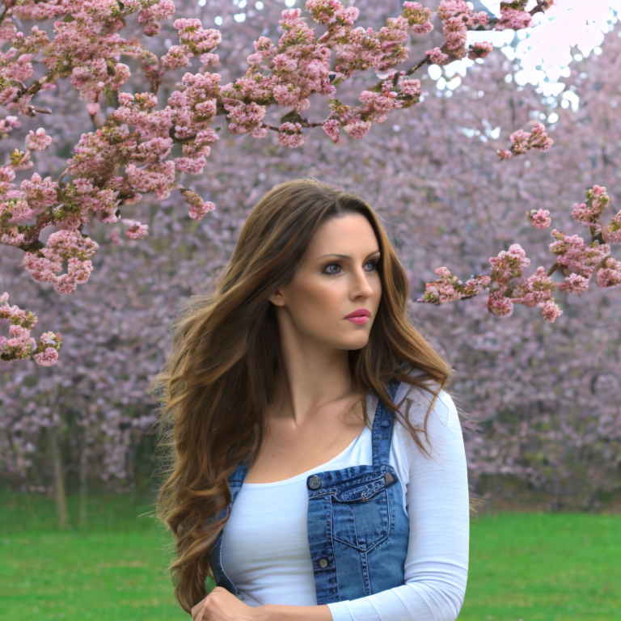
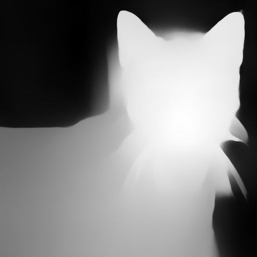
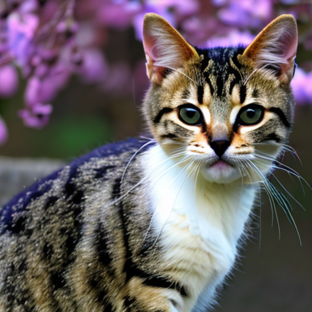

# Camera Settings as Tokens
[[paper]](https://dl.acm.org/doi/10.1145/3680528.3687635)[[project page]](https://camera-settings-as-tokens.github.io/)[[demo]](https://huggingface.co/spaces/Camera-Settings-as-Tokens/Camera-Settings-as-Tokens)[[dataset]](https://github.com/aiiu-lab/CameraSettings20K)[[model]](https://huggingface.co/ishengfang/Camera-Settings-as-Tokens-SD2)

Offical code for our SIGGRAPH Asia 2024 paper, Camera Settings as Tokens: Modeling Photography on Latent Diffusion Models

## TL;DR: Camera Settings 📷 + Text 📝 ⮕ Image 🖼️ 


## Requirements
We highly recommend using the [Conda](https://docs.anaconda.com/miniconda/) to build the environment. 

You can build and activate the environment by following commands. 
```bash
conda env create -f env.yml 
conda activate Camera-Settings-as-Tokens
```

## Text-n-Camera-Settngs-to-Image Generation
We provide the code for text-to-image generation with the pre-trained model. 

### Usage
```bash
python text+cam2image.py --prompt "half body portrait of a beautiful Portuguese woman, pale skin, brown hair with blonde highlights, wearing jeans, nature and cherry blossom trees in background" \
--negative_prompt "ugly, duplicate, morbid, mutilated, out of frame, extra fingers, mutated hands, poorly drawn hands, poorly drawn face, mutation, deformed, ugly, blurry, bad anatomy, bad proportions, extra limbs, cloned face, disfigured, out of frame, ugly, extra limbs, bad anatomy, gross proportions, malformed limbs, missing arms, missing legs, extra legs, mutated hands fused fingers, too many fingers, long neck" \
--focal_length 50 --f_number 1.8 --iso_speed_rating 100 --exposure_time 0.01 --output_basename "woman_cherry_blossom_trees" --lora_scale 1.0
```
For imaginary prompt, such as "astronaut riding a horse on the moon", we recommand to set the `--lora_scale` to 0.5.

### Results


## Text-n-Camera-Settngs-to-Image Generation with ControlNet
We provide the code for text-to-image generation with ControlNet.
Notice that due to differences in the implementation of LoRA merging, the recommended LoRA scale is 0.55 instead of 0.275 as reported in the appendix of our SIGGRAPH Asia 2024 paper.

### Usage
#### With Image for Conditioning
```bash
python text+cam2image_w_controlnet.py --prompt "a cute cat, nature and cherry blossom trees in background" \
--image_for_conditioning <path for image for conditioning> \
--negative_prompt "ugly, duplicate, morbid, mutilated, out of frame, extra fingers, mutated hands, poorly drawn hands, poorly drawn face, mutation, deformed, ugly, blurry, bad anatomy, bad proportions, extra limbs, cloned face, disfigured, out of frame, ugly, extra limbs, bad anatomy, gross proportions, malformed limbs, missing arms, missing legs, extra legs, mutated hands fused fingers, too many fingers, long neck" \
--focal_length 50 --f_number 1.8 --iso_speed_rating 100 --exposure_time 0.01 --output_basename "cat_cherry_blossom_trees" --lora_scale 0.55
```

#### With Conditional Image
```bash
python text+cam2image_w_controlnet.py --prompt "a cute cat, nature and cherry blossom trees in background" \
--conditional_image results/depth_cat_cherry_blossom_trees.png \
--negative_prompt "ugly, duplicate, morbid, mutilated, out of frame, extra fingers, mutated hands, poorly drawn hands, poorly drawn face, mutation, deformed, ugly, blurry, bad anatomy, bad proportions, extra limbs, cloned face, disfigured, out of frame, ugly, extra limbs, bad anatomy, gross proportions, malformed limbs, missing arms, missing legs, extra legs, mutated hands fused fingers, too many fingers, long neck" \
--focal_length 50 --f_number 1.8 --iso_speed_rating 100 --exposure_time 0.01 --output_basename "cat_cherry_blossom_trees" --lora_scale 0.55
```

### Results



## ToDo
- [ ] Code for image editing
- [v] Code for inference with ControlNet
- [ ] Add the code for the training
- [ ] SDXL

## Notice
This code and model are for research only. For other purposes, please contact us.

## Citation
```Bibtex
@inproceedings{fang2024camera,
  title={Camera Settings as Tokens: Modeling Photography on Latent Diffusion Models},
  author={I-Sheng Fang and Yue-Hua Han and Jun-Cheng Chen},
  booktitle={SIGGRAPH Asia},
  year={2024}
}
```
